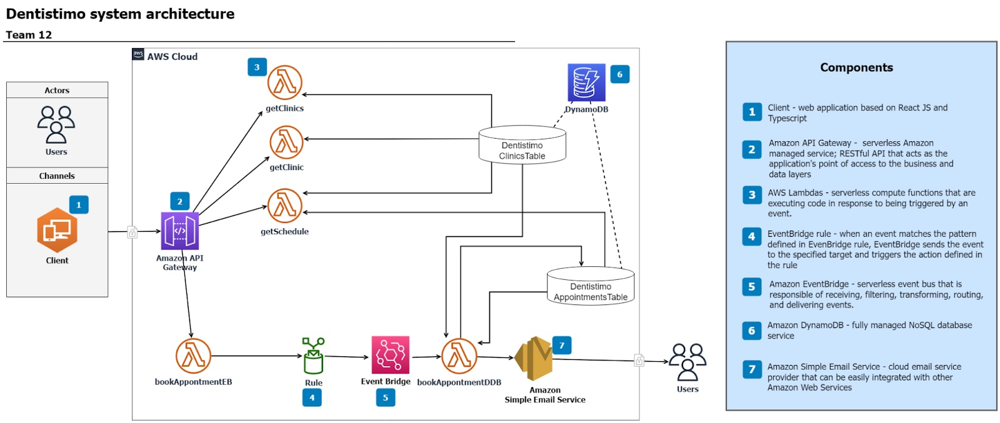
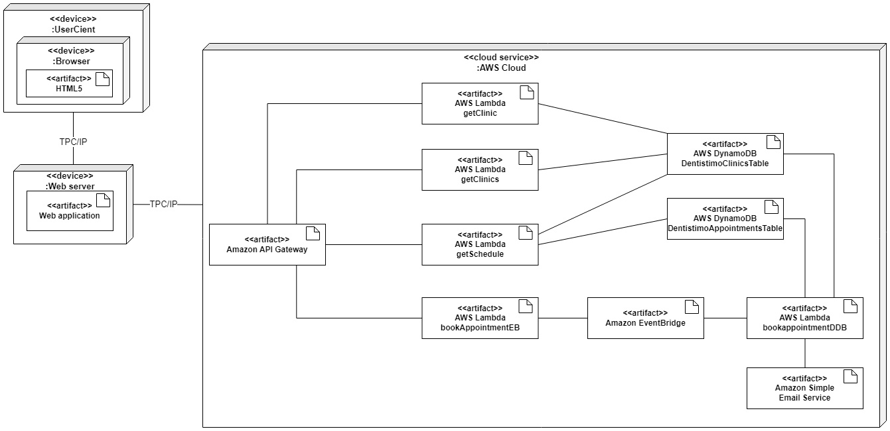

# T12 Project

## Project Structure

| File        | Purpose           | What you do?  |
| ------------- | ------------- | ----- |
| `aws-service/` | Backend server code | All our backend code |
| [aws-service/README.md](aws-service/README.md) | Everything about our AWS cloud services | **READ ME** carefully! |
| `client/` | Frontend client code | All our client code |
| [client/README.md](client/README.md) | Everything about the client | **READ ME** carefully! |
| `deprecated/` | Deprecated project code | All unused and deprecated code for this project |
| `images/` | Images for project diagrams | All our project diagrams |

## Requirements

The version numbers in brackets indicate the tested versions but feel free to use more recent versions.
You can also use alternative tools if you know how to configure them (e.g., Firefox instead of Chrome).

* [Git](https://git-scm.com/) (v2) => [installation instructions](https://www.atlassian.com/git/tutorials/install-git)
  * [Add your Git username and set your email](https://docs.gitlab.com/ce/gitlab-basics/start-using-git.html#add-your-git-username-and-set-your-email)
    * `git config --global user.name "YOUR_USERNAME"` => check `git config --global user.name`
    * `git config --global user.email "email@example.com"` => check `git config --global user.email`
  * > **Windows users**: We recommend to use the [Git Bash](https://www.atlassian.com/git/tutorials/git-bash) shell from your Git installation or the Bash shell from the [Windows Subsystem for Linux](https://docs.microsoft.com/en-us/windows/wsl/install-win10) to run all shell commands for this project.
* [Chalmers GitLab](https://git.ita.chalmers.se/) => Login with your **Chalmers CID** choosing "Sign in with" **Chalmers Login**. (contact [support@chalmers.se](mailto:support@chalmers.se) if you don't have one)
  * DIT341 course group: https://git.ita.chalmers.se/courses/dit341
  * [Setup SSH key with Gitlab](https://docs.gitlab.com/ee/ssh/)
    * Create an SSH key pair `ssh-keygen -t ed25519 -C "email@example.com"` (skip if you already have one)
    * Add your public SSH key to your Gitlab profile under https://git.ita.chalmers.se/profile/keys
    * Make sure the email you use to commit is registered under https://git.ita.chalmers.se/profile/emails
  * Checkout the [Backend-Frontend](https://git.ita.chalmers.se/courses/dit341/group-00-web) template `git clone git@git.chalmers.se:courses/dit355/dit356-2022/t-12/t12-project.git`
* [AWS Requirements](./aws-service/README.md)
* [Client Requirements](./client/README.md)
## Add your files

- [ ] [Create](https://docs.gitlab.com/ee/user/project/repository/web_editor.html#create-a-file) or [upload](https://docs.gitlab.com/ee/user/project/repository/web_editor.html#upload-a-file) files
- [ ] [Add files using the command line](https://docs.gitlab.com/ee/gitlab-basics/add-file.html#add-a-file-using-the-command-line) or push an existing Git repository with the following command:

```
cd existing_repo
git remote add origin https://git.chalmers.se/courses/dit355/dit356-2022/t-12/t12-project.git
git branch -M main
git push -uf origin main
```

> Check out the detailed instructions for [backend](./aws-service/README.md) and [frontend](./client/README.md).

## Visual Studio Code (VSCode)

Open the `aws-service` and `client` in separate VSCode workspaces. Otherwise, workspace-specific settings don't work properly.

## Component Diagram


## Deployment Diagram


## Management Information
* [Team contract](https://docs.google.com/document/d/1PkyUxVrU0eNpNeg57AUOUS2Zt7LKS6iw/edit?usp=sharing&ouid=117252867812016978037&rtpof=true&sd=true)

## Team Resources
* [Trello](https://trello.com/invite/b/GWsPME3M/ATTIb7151a32a7cd6e7e40776d94d12bf67578891589/dit-356-2022-team-12)
* [GitLab](https://git.chalmers.se/-/ide/project/courses/dit355/dit356-2022/t-12/t12-project)
* [Slack](https://dit356h22miniproject.slack.com/archives/C049J807HHR)
* [Discord](https://discord.gg/F64bbzA7)
* [G-Drive](https://docs.google.com/document/d/1wGDZf7wz66K8dJopoc7XrrgvpvTwefONcH48T1UvmCk/edit?usp=share_link)

## Frontend

### Requirements

#### Home Page
1.1 The system shall have a web-based user interface, so that the system can be accessible from multiple devices <br />
1.2 The home page shall contain a map-view over Gothenburg, so that that can be navigated by the patient. <br />
1.3 The map shall have interactive pins for clinics, so that the patient can select their desired clinic. <br />
1.4 The home page shall also contain a date picker, for the patient to select their desired date. <br />
1.5 The home page shall have a clinic overview section, in order for the patient to see more information regarding the clinic they have selected. <br />
1.6 The patient shall only be able to navigate to the appointments booking page once a clinic and date have been selected, in order for the patient to request an appointment with a clinic on a specific date.

#### Appointments Page
2.1 The bookings page shall visualize the supply /available time slots for appointments via color coding, so that the patient can easily tell which time slots are already fully booked. <br />
2.2 Time slots bookings shall be every full or half hour only (i.e. 12:00 or 12:30), to accommodate 30-minute appointments. <br />
2.3 No appointments shall be available for booking from 12:00 to 13:00, so that dentists can take a lunch break. <br />
2.4 No appointments shall be available for booking from 14:30 to 15:00, so that dentists can go on a fika break. <br />
2.5 A patient shall be able to request an appointment with their provided information, so that their appointment booking can be traced back to them. <br />
2.6 The patient shall be prompted for missing input if there are invalid input parameters, so that only valid booking requests can be made for processing.

#### Confirmation Notification
3.1 The patient shall receive an email with a status update regarding their booking request, so that they can ascertain whether their appointment booking is confirmed or rejected. <br />
3.2 The patient shall receive a confirmation email upon successful booking acceptance, so that they know if their booking request has been successfully completed. <br />
3.3 The patient shall receive a rejection email with a detailed reason as to why their booking request cannot be completed, so that they know why their booking request could not be processed for completion. <br />
3.4 The patient shall receive a link back to dentistimo.com upon receipt of a rejection email regarding their booking, so that they can try again for another date, clinic, and/ or time if they need.

## Backend

### Requirements
4.1 The system must be highly available. <br />
4.2 The system must scale automatically between a few requests per day to thousands per second. <br />
4.3 The system must have concurrency limits and provisioned concurrency for control over the scaling and responsiveness of the dentistimo production application. <br />
4.4 The system event bus must consistently ingest, filter, transform, and deliver events. <br />
4.5 The system event bus must have a QoS of 1. <br />
4.6 The system database must be automatically backed up and restored. <br />
4.7 The system database must have a guaranteed reliability with a service level agreement of up to 99.999% availability. <br />
4.8 The system must be able to send emails for correspondence regarding appointments.


## Architectural Drivers

### Frontend
We decided to go with a web-client as a website as it is portable and accessible to users across all devices. TypeScript happens to be relatively similar to JavaScript, which we have experience with from a previous course, which makes the development phase less stressful, and less error-prone. In order to minimise the potential risks from being less experienced with a programming language, we decided to use TypeScript, which shares a lot of its syntax from JavaScript. We have also decided to use the React framework for its ease of learning and how it contains plenty of functionality we may use throughout the development phase.

### AWS API Gateway
Amazon API Gateway is an AWS service for creating, publishing, maintaining, monitoring, and securing our RESTful HTTP APIs at any scale. We chose to integrate the AWS API Gateway as it handles all the tasks involved in accepting and processing up to hundreds of thousands of concurrent API calls. These tasks include traffic management, authorization and access control, monitoring, and API version management. Our API Gateway acts as a "front door" for applications to access data, business logic, or functionality from our backend services, such as code running on AWS Lambda, data stored on our DynamoDB tables, and connection to our bus EventBridge.

### AWS Lambda
AWS Lambda is a serverless compute service which runs our code in response to events, and it also manages underlying compute resources. The events might include in state or updates, for example booking an appointment with a dental clinic. AWS Lambdas can be used to extend other AWS services such as API Gateway, Event-Bridge, DynamoDB, and SES. It is also a highly scalable solution due to the infinite amount of Lambdas that can connect to each other, and even with other services within the AWS toolkit. Lambdas come with built-in fault tolerance as they run across multiple Availability Zones in each region, which protects against individual machine or data center failures. Its scalability is also automated, because it invokes the code only when needed and scales to the amount of requests being made at a certain time. This proves to be  a useful solution for us since Lambdas are paid per usage instead of per server unit. Lambdas are invoked through events that run, an example of this can be that someone enters information that then invokes a lambda, the lambda in turn invokes an Event-Bridge that in turn invokes another lambda that then writes the information to a DynamoDB.

### AWS EventBridge
We decided to choose EventBridge as our component responsible for implementing the event bus instead of MQTT because of reduced difficulty of implementation for our developers, as well as ease of integration with the rest of the AWS stack. Moreover, it is an accessible addition of the event-driven architecture to our system, and provides a way to manage concurrent requests from the front-end since it keeps the order in which requests were received in the event bus. 

### AWS DynamoDB
Amazon DynamoDB is a fully managed NoSQL database service that provides fast and predictable performance with seamless scalability. We chose this solution as DynamoDB lets our system offload the administrative burdens of operating and scaling a distributed database so that we don't have to worry about hardware provisioning, setup and configuration, replication, software patching, or cluster scaling. DynamoDB also offers encryption at rest, which eliminates the operational burden and complexity involved in protecting sensitive data. DynamoDBlets us create database tables that can store and retrieve any amount of data and serve any level of request traffic. We can scale up or scale down our tables’ (DentistimoClinics and DentistimoAppointmentBookings) throughput capacity without downtime or performance degradation. DynamoDB automatically spreads the data and traffic for our tables over a sufficient number of servers to handle our throughput and storage requirements, while maintaining consistent and fast performance. All of our data is stored on solid-state disks (SSDs) and is automatically replicated across multiple Availability Zones in an AWS Region, providing built-in high availability and data durability.

### AWS SES (Simple Email Service)
SES (Simple Email Service) was chosen in order to satisfy the requirement of sending request feedback to the user upon the attempt of booking an appointment. In our system, when a booking is successful, an approved booking will trigger the sending of a successful booking email, whereas an unsuccessful booking (for example, if the selected time slot was taken faster by another user) will trigger the sending of a failed booking email prompting the user to try again with the provided URL back to our dentistimo website.

### AWS CloudFormation
Additionally, in order to leverage Amazon’s very useful solution for building and managing the system, we used CloudFormation in order to create or delete the entire stack at will, with all the necessary permissions and connections. In order to be able to create the stack on any operating system, we have created linux scripts that when run, deploy the entire system based on the source code files on our repository (zipping the files, uploading them to the S3 bucket, creating the stack based on the template).

### Motivation
We leveraged the advantages of the Infrastructure-as-Code architectural style by choosing Amazon Web Services. The driving forces behind this decision were:
Ease of integration between AWS products (API Gateway, Lambdas, Event Bridge, DynamoDB, and SES). Due to the limited amount of time to final submission, the team assessed that it would be a more efficient use of time to utilise the AWS cloud hosting service to do without setting up boxes and wires when setting up our own servers. In this way, we are able to better focus on the business logic and provide more functionality instead of using our limited time with setting up servers.

### Conclusion
Further into development, we determined that a stream like AWS Kafka would have been a better method to connect our Lambdas to our Database. Unfortunately, we had invested enough time in setting up EventBridge and had no time to spare to migrate to Kafka, so we continued its integration with our system. Overall, we consider the system as a whole to be very fault tolerant since it runs on Amazon’s very reliable servers which have global distribution, as well as scalable, performant and highly available.

## Developers
* [Dragos Florinel Isar](@florinel)
* [Gabriela Istrate](@istrate)
* [Aditya Nair](@adityana)
* [Jens Pehrsson](@jenspeh)
* [Julia Van Kirk](@juliava)
